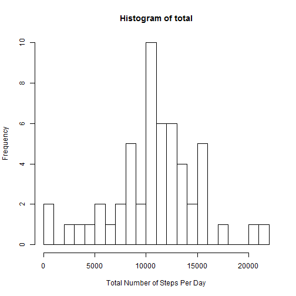
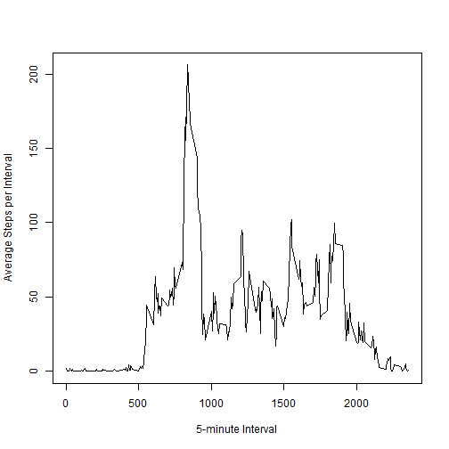
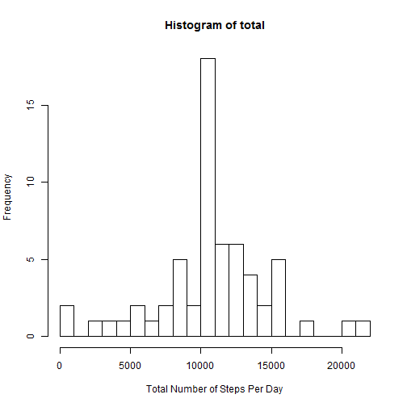
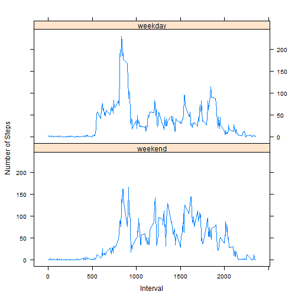

# Loading and preprocessing the data


```r
# 1. Load the data

actdata <- read.csv("activity.csv", header = TRUE)

# 2. Remove the NA values

good <- complete.cases(actdata)
gooddata <- actdata[good, ]
```

# What is mean total number of steps taken per day? 
For this part of the assignment, ignore the missing values in the dataset.


```r
# 1. Calculate the total number of steps taken per day

total <- tapply(gooddata$steps, gooddata$date, sum)

# 2. Make a histogram of the total number of steps taken each day

hist(total, xlab = "Total Number of Steps Per Day")
```



```r
# 3. Calculate and report the mean and median of the total number of steps taken per day
  
m1 <- mean(total, na.rm = TRUE)
m2 <- median(total, na.rm = TRUE)

print(paste("The mean of the total number of steps taken per day is", m1, "and the median of the total number of steps taken per day is", m2))
```

```
## [1] "The mean of the total number of steps taken per day is 10766.1886792453 and the median of the total number of steps taken per day is 10765"
```


# What is the average daily activity pattern?


```r
# 1. Make a time series plot of the 5-minute interval (x-axis) and the average number of steps taken, averaged across all days (y-axis)

average <- tapply(gooddata$steps, as.factor(gooddata$interval), mean)
plot(unique(actdata$interval), average, type = "l", xlab = "5-minute Interval", ylab = "Average Steps per Interval")
```



```r
# 2. Which 5-minute interval, on average across all the days in the dataset, contains the maximum number of steps?

newdata <- data.frame(cbind(average, unique(actdata$interval))) 
interval <- newdata[newdata$average == max(average), 2]
print(interval)  
```

```
## [1] 835
```

# Imputing missing values


```r
# 1. Calculate and report the total number of missing values in the dataset 

na <- sum(is.na(actdata$steps))
print(paste("The total number of missing values in the dataset is", na))
```

```
## [1] "The total number of missing values in the dataset is 2304"
```

```r
# 2. Devise a strategy for filling in all of the missing values in the dataset (use the mean for that 5-minute interval).

for(i in 1:length(actdata$steps)){
  
  if (is.na(actdata$steps[i])) {
  actdata$steps[i] <- newdata[newdata[, 2] == actdata$interval[i], 1]
 }  
}

# 3. Create a new dataset that is equal to the original dataset but with the missing data filled in.

for(i in 1:length(actdata$steps)){
  if (is.na(actdata$steps[i])) {actdata$steps[i] <- newdata[newdata[, 2] == actdata$interval[i], 1]}  
}
fulldata <- actdata

# 4. Make a histogram of the total number of steps taken each day and Calculate and report the mean and median total number of steps taken per day. 
  
  total <- tapply(fulldata$steps, fulldata$date, sum)

  hist(total, xlab = "Total Number of Steps Per Day")
```



```r
  fullm1 <- mean(total, na.rm = TRUE)
  fullm2 <- median(total, na.rm = TRUE)

print(paste("The mean of the total number of steps taken per day is", fullm1, "and the median of the total number of steps taken per day is", fullm2))
```

```
## [1] "The mean of the total number of steps taken per day is 10766.1886792453 and the median of the total number of steps taken per day is 10766.1886792453"
```
I use the mean for that 5-minute interval to replace the NA. The mean of the total daily number of steps is the same as that from the first part of the assignment. However, the median is different a little bit.  The impact of imputing missing data on the estimates of the total daily number of steps is reducing the bias from some calculations or summaries of the data.

# Are there differences in activity patterns between weekdays and weekends?


```r
# 1. Create a new factor variable in the dataset with two levels - "weekday" and "weekend" indicating whether a given date is a weekday or weekend day.

w <- weekdays(as.Date(as.character(fulldata$date)))

for(i in 1:length(w)){
  if (w[i] %in% c("Monday", "Tuesday", "Wednesday", "Thursday", "Friday")){w[i] <- "weekday"}
  else {w[i] <- "weekend"}
}

week <- as.factor(w)
findata <- cbind(fulldata, week)

# 2. Make a panel plot containing a time series plot (i.e. type = "l") of the 5-minute interval (x-axis) and the average number of steps taken, averaged across all weekday days or weekend days (y-axis). 

weekday <- subset(findata, week == "weekday")
weekend <- subset(findata, week == "weekend")

aveweekday <- tapply(weekday$steps, as.factor(weekday$interval), mean)
aveweekend <- tapply(weekend$steps, as.factor(weekend$interval), mean)

dfweekday <- data.frame(cbind(aveweekday, unique(findata$interval), rep("weekday", length(aveweekday))))
dfweekend <- data.frame(cbind(aveweekend, unique(findata$interval), rep("weekend", length(aveweekend))))

names(dfweekday) <- c("Averagesteps", "Interval", "Week")
names(dfweekend) <- c("Averagesteps", "Interval", "Week")
df <- rbind(dfweekend, dfweekday)
df$Averagesteps <- as.numeric(as.character(df$Averagesteps))
df$Interval <- as.numeric(as.character(df$Interval))

library(lattice)
xyplot(Averagesteps ~ Interval | Week, data = df, type = "l", layout = c(1, 2), xlab = "Interval", ylab = "Number of Steps")
```




